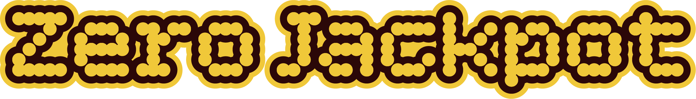

  

# ZeroJackpot

An interactive Eurojackpot-style odds simulator built with vanilla JavaScript. **The site’s purpose is to inform people about gambling, lottery odds, and probability** — turning abstract chances into something you can see and explore through simulation.

## Description

ZeroJackpot lets you pick or randomise lottery lines and run thousands (or millions) of virtual draws to see how often you would win, what it would cost, and how prize tiers behave.

## Features

- Pick 5 main numbers (1–50) and 2 star numbers (1–12)
- Random full lines
- Simulate 100, 1,000, 10,000, 100,000, 1,000,000 or 10,000,000 draws
- Win distribution aligned with Eurojackpot-style rules
- Total cost and net result
- Optional comparison with a simple index-fund scenario (7% annual return)
- Responsive layout (mobile and desktop)
- Progress indicator and highlight of the best draw

## Tech stack

- HTML5
- CSS3 (responsive)
- Vanilla JavaScript (ES6+)
- No backend — static frontend only

## Setup

1. Clone or download the project.
2. Run a **local web server** (i18n loads `i18n/*.json` via `fetch`; opening `file://` usually fails). For example: `npx serve .` or VS Code Live Server.
3. Open the site at `http://localhost:...`

## Languages (i18n)

- Message files: `i18n/sv.json`, `en.json`, `de.json`, `es.json` (same key structure).
- Language selection order: **`?lang=en|de|es`** in the URL (first), then the browser, then `localStorage` (`zerojackpot-lang`). The address bar is updated with `?lang=…` when the language is not Swedish (shareable links + SEO). You can also switch language via the footer flags.
- **SEO:** `hreflang` (sv/en/de/es + `x-default`) in HTML, `sitemap.xml` with `xhtml:link` alternates, dynamic `canonical` and `og:url` in `js/i18n.js`. **`llms.txt`** gives a short site summary for AI/LLM crawlers (optional convention).
- **Swedish:** SEK, line price 25. **English / German / Spanish:** EUR, line price 2 (UK, Germany, Spain) — see `js/logic.js` and `meta.ticketPrice` in each locale file.
- Core scripts: `js/i18n.js` (loading, `data-i18n`, meta/JSON-LD), `js/logic.js` (currency & `Intl`), `js/jakten.js` (live draw page).
- To refresh translations: edit the JSON files. To regenerate `en.json` / `de.json` / `es.json` from the build pipeline, run `node scripts/build-i18n-en-de-es.js` (overwrites those three files).

## Usage

1. Tap the circles to choose 5 main numbers and 2 star numbers, or use **Pick your numbers** / random line controls.
2. Choose how many draws to simulate.
3. Review results, distribution, and optional investment comparison.

## Prize tier reference

Based on a Eurojackpot-style prize table (amounts in **EUR** as in the simulator for English / German / Spanish locales — same tier structure as SEK, converted at **11.25 SEK per €** and rounded):

| Tier | Match | Approx. prize |
|------|-------|----------------|
| 1 | 5+2 | €35,555,556 (jackpot) |
| 2 | 5+1 | €177,778 |
| 3 | 5+0 | €35,556 |
| 4 | 4+2 | €1,422 |
| 5 | 4+1 | €80 |
| 6 | 3+2 | €44 |
| 7 | 4+0 | €36 |
| 8 | 2+2 | €16 |
| 9 | 3+1 | €13 |
| 10 | 3+0 | €11 |
| 11 | 1+2 | €8 |
| 12 | 2+1 | €6 |

## Responsible play

This project is for **education and awareness**, not gambling advice. It illustrates how unlikely wins are compared to stakes.

If gambling is causing problems for you or someone close to you, seek help. The **About** page on the site lists resources per language; here is a short overview:

- **Sweden — [Stödlinjen](https://www.stodlinjen.se)** · phone **020-819 100** (daily 09:00–21:00)
- **United Kingdom — [GamCare](https://www.gamcare.org.uk)** · National Gambling Helpline **0808 8020 133** (free, 24/7) · **[Be Gamble Aware](https://www.begambleaware.org)**
- **Germany — [BZgA – Spielen mit Verantwortung](https://www.spielen-mit-verantwortung.de)** · hotline **0800 1 37 27 00** · **[Deutsche Hauptstelle für Suchtfragen (DHS)](https://www.dhs.de)**
- **Spain — [JugarBIEN](https://www.jugarbien.es)** (Ministerio de Consumo) · **[FEJAR](https://www.fejar.org)** (support for people affected by gambling)

## License

**All rights reserved.** The ZeroJackpot name, branding, code, text, and assets in this repository are **not** offered under an open-source or “free for personal use” licence. No licence is granted to copy, modify, distribute, host, or reuse this work for personal or commercial purposes **without prior written permission** from the rights holder.

If you need a licence or partnership, contact the repository owner.

  <a href="https://www.zerojackpot.eu"><strong>www.zerojackpot.eu</strong></a>   
  

